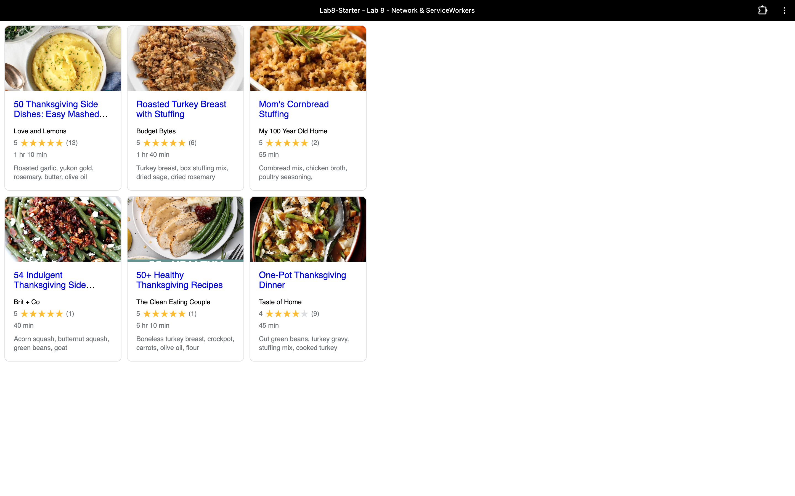

# Lab8-Starter
By: Ryandeep Shelopal

Graceful degradation can be thought of as an app that can still function as you slowly remove
or degrade functionalities. This can be related to service workers because with service workers
when you are off the internet or network, service workers still are able to pull data to have the 
app function similar to how graceful degradation works.

https://rdshelopal.github.io/Lab8-Starter/

